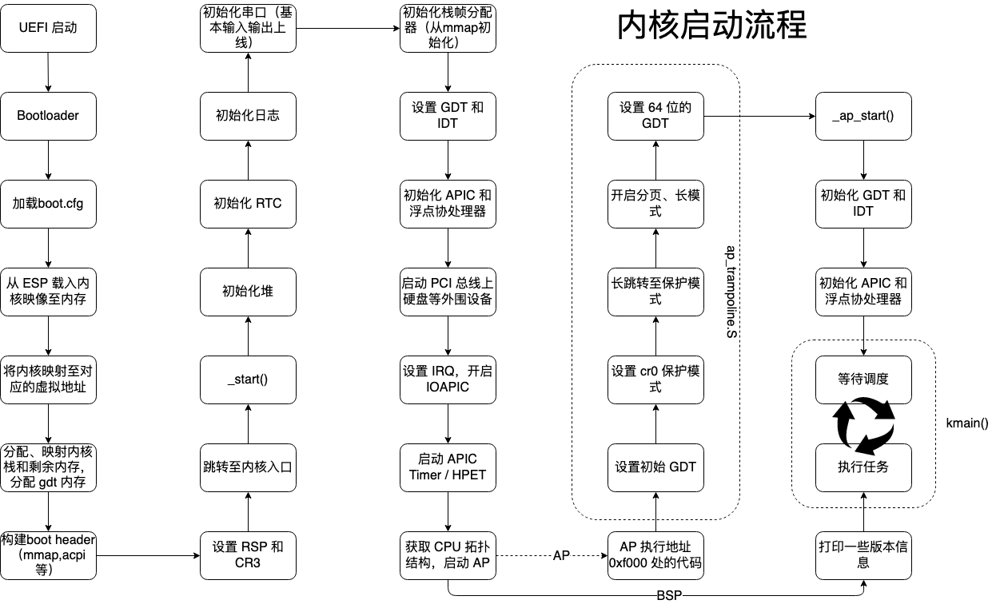

# 开始进行内核启动编写

在本节中，我们将要开始进行内核启动的编写。内核启动的相关流程如下图：



```rust
/// The entry point of kernel
#[no_mangle]
pub unsafe extern "C" fn _start(header: *const Header) -> ! {
    let header = unsafe { &*(header) };
    // Initialize the heap.
    let heap = init_heap();

    // Initialize RTC for read.
    init_rtc();

    // Initialize logging on the fly.
    // This operation is safe as long as the macro is not called.
    init_env_logger().unwrap();
    // Initialize the serial port for logging.
    init_all_serial_ports();

    kwarn!("logger started!");
    kinfo!("logging level is {}", *LOG_LEVEL);
    kinfo!("heap starts at {:#x}", heap);

    if let Err(errno) = init_kernel_page_table() {
        panic!(
            "failed to initialize kernel page tables! Errno: {:?}",
            errno
        );
    }
    kinfo!("initialized kernel page tables");
```

上面是内核启动程序的入口点，代码定义于`kernel\src\arch\x86_64\boot\mod.rs`，其中的每一步都是以函数调用的形式实现的。

当内核启动后，操作系统可以说是成功正式启动。其中有许多关键步骤，接下来将进行逐一分析。

## 堆初始化

在操作系统中，堆是一块用于动态内存分配的区域。当应用程序或系统需要在运行时分配和释放内存块时，它就会使用堆。初始化堆主要作用包括：定义可用内存区域、设置起始和结束边界、提供内存管理机制、保障线程或进程安全、优化内存使用、预分配、错误检测与处理等等。我们在 `kernel\src\memory.rs` 中实现了堆初始化的相关定义。

```rust
/// The memory can be used only after we have initialized the heap!
pub fn init_heap() -> usize {
    const MACHINE_ALIGN: usize = core::mem::size_of::<usize>();
    const HEAP_BLOCK: usize = KERNEL_HEAP_SIZE / MACHINE_ALIGN;
    static mut HEAP: [usize; HEAP_BLOCK] = [0; HEAP_BLOCK];

    unsafe {
        // Initialize the heap.
        super::ALLOCATOR
            .lock()
            .init(HEAP.as_ptr() as usize, HEAP_BLOCK * MACHINE_ALIGN);
        HEAP.as_ptr() as usize
    }
}
```

我们可以发现，该函数通过指定一块 **bss** 区域作为初始堆的起始地址，该区域通过 **ld** 脚本（该脚本制定了 **bss** 所在的虚拟地址）实现。由于在 **bootloader** 阶段已经把 **bss** 区域映射到了虚拟地址，因此可以对其进行直接访问。


## 物理内存初始化

物理内存初始化无疑是所有操作系统启动和设置过程中的一个关键步骤，本操作系统当然也不例外。物理内存的初始化主要目的是识别、组织和管理计算机上的实际物理内存，为系统的正常运行做准备。物理内存初始化的作用和意义是：物理内存识别、内存映射建立、页面管理的准备、为核心数据结构提供空间、支持动态内存管理、减少碎片化、保护和隔离、硬件特性的利用、为内存驱动和扩展做准备等。物理内存初始化的相关代码我们定义在 `kernel/src/arch_x86_64/mm/paging.rs`。

```rust
/// Inserts all UEFI mapped memory regions into the bitmap-based frame allocator.
/// It is important for the use of the memory management.
pub fn init_mm(header: &'static Header) -> KResult<()> {
    // Initialize the kernel frame allocator for the user space.
    let mut allocator = LOCKED_FRAME_ALLOCATOR.lock();
    // Reinterpret the memory region.
    let mmap = unsafe {
        core::slice::from_raw_parts(
            phys_to_virt(header.mmap) as *const MemoryDescriptor,
            header.mmap_len as usize,
        )
    };

    for descriptor in mmap.iter() {
        kdebug!("init_mm(): {:x?}", descriptor);

        if descriptor.ty == MemoryType::CONVENTIONAL {
            let start_frame = descriptor.phys_start as usize / PAGE_SIZE;
            let end_frame = start_frame + descriptor.page_count as usize;
            allocator.insert(start_frame..end_frame)?;
        }
    }

    Ok(())
```

该函数将 bootloader 读取到的物理内存信息进行存储，之后将这些信息传递给物理页帧分配器用于给之后的内存分配做准备。

同时我们也需要构建页表相关的函数，例如：

```rust
/// This function will take the page table constructed by the bootloader and reconstruct
/// mapping from virtual adrdress into physical address. Then, it completely invalidates
/// previous page tables. After this function is exeucted, we can divide the kernel virtual
/// memory space into several segments listed in the module document above.
pub fn init_kernel_page_table() -> KResult<()> {
    let mut page_table = KernelPageTable::active();

    page_table.print();

    Ok(())
}
```

## CPU与ACPI初始化

相关代码定义于 `kernel/src/arch_x86_64/cpu.rs` 和 ` kernel/src/arch_x86_64/acpi.rs`。

```rust
/// Initialize the Advanced Programmable Interrupt Controller.
pub fn init_cpu() -> KResult<()> {
    init_apic()?;

    kinfo!(
        "init_cpu(): {:#x?}",
        LOCAL_APIC.read().get(&cpu_id()).unwrap().get_info(),
    );

    unsafe {
        enable_float_processing_unit();
    }

    Ok(())
}
```

该函数功能具体通过如下几个步骤实现：
1. init_apic：启动 Advanced Programmable Interrupt Handler，用于初始化各个核心的中断
处理器。APIC 的具体功能和实现请查询 wiki
2. enable_float_processing_unit：启动浮点单元，启动后可以计算浮点数。

顺理成章的来看一看acpi
```rust
pub fn init_acpi(header: &Header) -> KResult<()> {
    let handler = AcpiHandlerImpl {};
    let table = match unsafe { AcpiTables::from_rsdp(handler, header.acpi2_rsdp_addr as usize) } {
        Ok(table) => table,
        Err(e) => {
            kerror!("init_acpi(): acpi parse kerror: {:?}", e);
            return Err(Errno::EINVAL);
        }
    };

    kdebug!("init_acpi(): revision: {:#x}", table.revision);

    // Check IoAPIC information.
    if let Ok(platform_info) = PlatformInfo::new(&table) {
        kinfo!("init_acpi(): showing platform information!");
        kdebug!("Interrupt model: {:#x?}", platform_info.interrupt_model);

        // Set the BSP.
        BSP_ID.call_once(|| {
            platform_info
                .processor_info
                .unwrap()
                .boot_processor
                .local_apic_id
        });

        if let InterruptModel::Apic(apic_information) = platform_info.interrupt_model {
            if apic_information.also_has_legacy_pics {
                disable_pic();
            }
            IRQ_TYPE.store(IrqType::Apic, Ordering::Release);

            // Collect mapping.
            collect_irq_mapping(&apic_information);
        }
    }

    // Get IA-PC High Precision Event Timer Table for `rdtsc` timer.
    if let Ok(hpet_table) = HpetInfo::new(&table) {
        // Initialize the HPET timer.
        if let Err(errno) = init_hpet(&hpet_table) {
            kerror!("init_acpi(): cannot initialize HPET due to {:?}.", errno);
            // Ignore this and fall back to `Acpi` timer.
            TIMER_SOURCE.store(TimerSource::Apic, Ordering::Release);
        }
    }

    if cfg!(feature = "multiprocessor") {
        unsafe {
            let madt = table
                .get_sdt::<Madt>(Signature::MADT)
                .map_err(|_| Errno::ENOSPC)?
                .ok_or(Errno::EEXIST)?;
            init_aps(&madt)
        }
    } else {
        Ok(())
    }
}
```

ACPI 是硬件启动后生成的一些硬件描述信息，与 APIC 应作区分。应当禁用其中包含的
PIC 信息（也就是 APIC 的前身），记录其中包含的 IRQ 的掩码。同时在此函数中初始化高精
度时钟 HEPT（qemu 不支持），并初始化其他 CPU 核心。

## CPU其他核心启动

NeoOS 是一个有多核心 CPU 操作系统。在多核心 CPU 模型下，默认启动的核心为 Bootstrap
Processor（BSP），其他核心为 Application Processor（AP）。AP 的启动时通过 Inter-Processor
Interrupt（IPI）。具体实现步骤如下：
1. 发送一次 INIT IPI，告知对应核心应当被唤醒。
2. 发送一次 STARTUP INIT，并等待执行，通过 IPI 给出的跳转指令进行跳转。其相关代码
定义于 kernel/src/arch/x86_64/boot/ap_trampoline.S。
3. 其他核心进入初始化并启动成功。

