# NeoOS 的 GitHub 仓库布局

本节主要介绍仓库的分布和布局。**随着时间的推移，本节内容可能会过时，请以最新的仓库布局为准。**

```text
.
├── boot
├── boot_header
├── doc
├── kernel
├── mem
```

上面给出了本仓库的根目录分布情况。

* `boot` crate：主要放置了 bootloader 和 UEFI 相关的工具和函数。如果你要实现 bootloader，请在这个 crate 里面进行开发。
* `boot_header` crate：这个库主要存放了内核和 bootloader 共享的启动信息。为了更好地操作，我们将内核版本、ACPI、内存布局信息、页表地址等数据统一打包成了一个 Rust 结构体并独立成一个 crate。这样的好处是让 bootloader 和内核都可以访问和修改。
* `doc`：存放本教程。你可以 `cd doc/zh` 然后 `mdbook serve` 的方式启动一个本地服务器来访问构建好的文档。安装 `mdbook` 的方法很简单，只需要 `cargo install mdbook` 即可。
* `kernel`：内核的主要代码。
* `mem`： **暂时尚未用到。**

在使用了 `Makefile` 之后可能根目录下面会出现 `target` 和 `test` 两个目录，其中前者是 Rust 构建的一些中间件和输出，后者是 QEMU 的工作区。

## 内核库的主要分布

```text
./kernel/src
├── arch
├── drivers
├── fs
├── irq
├── mm
├── process
├── signal
└── sync
```

* `arch`：存放着架构特定的实现代码。因为目前我们只有 `x86_64`，所以这个目录下面只实现这个架构的特定功能。

  ```text
  ./kernel/src/arch/x86_64
  ├── acpi.rs
  ├── apic
  ├── boot
  ├── cpu.rs
  ├── gdt.rs
  ├── hpet.rs
  ├── interrupt
  ├── io.rs
  ├── mm
  ├── mod.rs
  ├── pit.rs
  └── timer.rs
  ```

  * `acpi.rs`：实现了 ACPI 硬件描述表。这个硬件描述表在 bootloader 中创建，然后通过 bootheader 传递给内核。这个描述表描述了当前硬件的一些信息，比如时钟、CPU 拓扑结构、HPET 表、中断信息等。里面重要的函数就是 `init_acpi`。
  * `apic.rs`：实现了高级可编程中断控制器（Advanced Programmable Interrupt Controller）。里面有 IOAPIC、X2APIC。因为 xAPIC 不太用了，本仓库暂时没有实现。**如果强制开启** `x2apic` 这个 feature 的话，会产生编译错误。
  * `boot`：主要实现内核自身的初始化和 CPU 其他核的初始化，可见 `_start()` 和 `_ap_start()`。
  * `cpu.rs`：主要实现了 CPU 一些特性的获取，对 CPU 的浮点状态的实现，对 CPU 直接进行一些操作，并对每个 CPU 核进行了抽象（见 `AbstractCPU` ）。
  * `gdt.rs`：主要是对全局描述符表的初始化。里面有一些常数定义了各个段的权限。
  * `hpet.rs`：高精度事件计时器。QEMU 似乎不支持（存疑）。
  * `interrupt`：实现内核中断、syscall、处理器间中断。一些功能通过 X86 汇编实现。
  * `io.rs`：主要是和 0x3f8 这个串口进行交互，使得输入输出能够正确实现。
  * `mm`：实现 `x86_64` 平台上的内存管理。主要是定义了页表，实现了一些常用功能。
  * `pit.rs`：实现了 Legacy 的可编程中断计时器（Programmable Interrupt Timer）。这个计时器在 APIC 计时器未初始化之前用来实现倒计时。
  * `timer.rs`：实现时钟相关的功能。

* `driver`：存放了各种驱动。
* `fs`：文件系统的实现。
* `irq`：中断请求的实现。
* `mm`：内核级别的内存管理。主要是对进程、线程的内存进行管理的。
* `process`：实现用户线程和进程。
* `signal`：实现类似 Unix 的信号机制。
* `sync`：实现了一系列的同步原语。例如 mutex（自旋锁）、futex（快速用户空间的 Mutex）等。

其他存放在 `kernel/src` 的源文件提供了一些额外的辅助功能，有一些功能和标准库是重叠的。

* `debug.rs`：实现了一些辅助 debug 的功能。比如栈信息打印。
* `error.rs`：定义了内核错误代码。
* `f32/f64.rs`：定义了浮点数的操作。这里的操作主要是通过 libm 实现的。
* `logging.rs`：实现日志系统。
* `time.rs`：仿照 `std::time` 实现的功能。
* `trigger.rs`：一个事件处理器。用于时钟中断。

## 内核的完整启动过程


